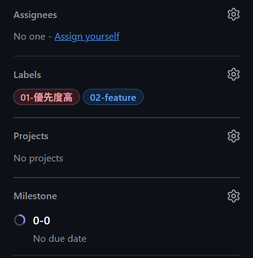

# git/github 開発手順書
このリポジトリで作業するときのルールと手順をまとめたものです

## 1.全体の流れ（詳細は4章を参照）
- 基本的にissueに自分をアサインして作業を始めること（issueが無ければ立ててください）
- 必ずdevelopを最新にしてから、作業ブランチを切る
- 作業が完了した場合は、issueをcloseする

```
main（安定版。発表・デモに使う）
  └── develop（みんなの作業をまとめる場所）
        ├── #12-capture-screen
        ├── #15-canvas-scroll
        └── ...（1つの Issue につき1本）
```

- 作業ブランチはdevelopから作って、Pull Requestでdevelopに戻す
- `main`には、developで動作確認が終わったものだけをmergeする
- `main`と`develop`に直接コミット・プッシュしない

## 2.ブランチ命名規則
ブランチの命名は次のようにすること
```
#<issue番号>-内容
```

内容はケバブケース（単語同士を`-`で繋ぐ記法）で簡潔に書くこと

例
| やること | issue | ブランチ名 |
|---|---|---|
| READMEを修正 | #20 | `#20-update-readme` |


## 3.コミット命名規則
コミット命名は次のようにすること
```
接頭辞/#<issue番号>-内容 
```

例
| やること | issue | コミットメッセージ |
|---|---|---|
| READMEを新規作成 | #20 | `docs/#20-READMEを新規作成` |
| READMEに○○の記述を追加 | #20 | `docs/#20-READMEに○○の記述を追加` |

接頭辞は以下の表を参考にする

| 接頭辞 | 内容 |
|---|---|
| feat | 新しい機能・ファイルの追加など |
| fix | 既存の機能の修正など |
| update | 問題はないけど、既存の機能を手直しする場合 |
| docs | ドキュメントの追加、修正など |
| chore | 上のどれにも当てはまらない項目 |

接頭辞は必要になり次第、随時追加

> 1日の作業を全部まとめてコミットするなどはせずに、1つのまとまりごとにコミットしてください。何かあった時に戻しやすくなります。

## 4.実際の作業手順（詳細）
### 4-1.issueにアサイン
1 .GitHubの「Issues」タブで、これからやるissueを開く（なければ新しく立てる）
2. 右側のタブから、Assignees・Labels・Milestoneを選択する（今回はProjectsは使用しない）



### 4-2.developを最新にする

```
git switch develop
git pull --ff-only origin develop
```

- `git switch develop` ･･･ developブランチに移動する
- `git pull --ff-only origin develop` ･･･GitHub上の最新のdevelopを取り込む

> `--ff-only`は「安全に更新できない時は止まる」オプション。もし止まったら無理して進めずに相談して下さい

### 4-3.作業ブランチを切る

```
git switch -c "#1-update-docs"
```

> `-c`は「新しいブランチを作って、そこに移動する」オプションです

**必ずdevelopブランチにいることを確認してから実行してください**

すでにブランチがある場合：

```
# 自分のPC（ローカル）にある場合
git switch #1-update-docs
git pull

# GitHub上（リモート）にだけある場合
git fetch origin
git switch -c #1-update-docs --track origin/#1-update-docs
```

作業を始める前に、今いるブランチを確認して、developやmainになっていないかどうかを確かめてください

```
git branch --show-current  # 今いるブランチのみ確認できる
git branch                 # ローカルにあるブランチ一覧が取得でき、今いるブランチも確認できる
```

VS Codeを使用している場合は、左下にも現在のブランチ名が表示されているので、そこからも確認できます

### 4-4.作業してコミットする
変更内容を確認する：
```
git status  # 変更されたファイルの一覧
git diff    # 変更の中身
```

コミットする変更を選ぶ（ステージング）：
```
git add .           # 全部の変更を選ぶ
git add <ファイル名> # 特定のファイルだけを選ぶ
```

コミットする：
```
git commit -m "docs/#1-docsにREADMEを追加"
```

### 4-5.プッシュする
そのブランチを初めててプッシュするとき：
```
git push -u origin #1-update-docs
```

> `-u`をつけると、自分のPCのブランチとGitHubのブランチが紐づきます。

2回目のプッシュ以降
```
git push
```

ここから先は、そのissueの作業が終わった時に行います。

### 4-6.Pull Requestを作成する
1. GitHubでリポジトリを開き、「Compare & pull request」を押す
2. baseが`develop`、compareが自分の作業ブランチになっていることを確認する
  - baseが`main`になっていたら`develop`に切り替える
3. タイトルに「issue番号と何をしたか」が分かるように書く（例：#1 docsを整備）
4. 説明欄に「対応したissue番号」、必要な場合は「何を変えたか・どうやって動作確認したか」を書く
5. 「Create pull request」を押す

### 4-7.mergeする
次を全て確認してから「Merge pull request」 → 「Confirm merge」を押す

- [] merge先（base）が`develop`になっているか
- [] 競合（Conflict）が表示されていない
- [] 自動チェックがある場合、全て成功している
- [] 自分の環境で動作確認した

競合やエラーが出ていたら、チームメンバーに相談してください

### 4-8.issueをcloseする
merge後、issueに「mergeしました」などのコメントを残してcloseする

使い終わったブランチは、GitHub上ではPR画面の「Delete branch」で消す
自分のPCのブランチは次のコマンドで消す

```
git switch develop
git pull --ff-only origin develop
git branch -d <対象のブランチ>
```

### 4-9.途中で中断・交代するとき
中断する前に必ずコミット、プッシュする
その後、issueに次のコメントを残す

```
- 終わったこと：
- 残っていること：
- 確認してほしいこと：
```